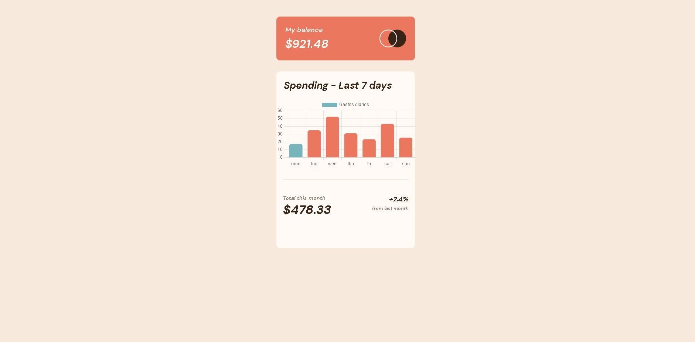

# Frontend Mentor - Expenses chart component solution

This is a solution to the [Expenses chart component challenge on Frontend Mentor](https://www.frontendmentor.io/challenges/expenses-chart-component-e7yJBUdjwt). Frontend Mentor challenges help you improve your coding skills by building realistic projects. 

## Table of contents


  - [The challenge](#the-challenge)
  - [Screenshot](#screenshot)
  - [Links](#links)
  - [Built with](#built-with)
  - [Author](#author)


### The challenge

Users should be able to:

- View the bar chart and hover over the individual bars to see the correct amounts for each day
- See the current day’s bar highlighted in a different colour to the other bars
- View the optimal layout for the content depending on their device’s screen size
- See hover states for all interactive elements on the page
- **Bonus**: Use the JSON data file provided to dynamically size the bars on the chart

### Screenshot




### Links

- Live Site URL: [Netlify]([https://your-live-site-url.com](https://chart-main.netlify.app/))


### Built with

- Semantic HTML5 markup
- CSS custom properties
- Flexbox
- Javascript
- Mobile-first workflow
- [Chart.js](https://www.chartjs.org/) - JS library


<h1>Some code I'm proud of</h1>
```

```js
if(diaSemana[fecha.getDay()] == day[fecha.getDay()-1]){
  colorsDay.fill('hsl(186, 34%, 60%)', fecha.getDay()-1,fecha.getDay());
}
```


## Author

- Frontend Mentor - [@Mancux2premium](https://www.frontendmentor.io/profile/Mancux2premium)
- Linkedin - [Benjamin Mancuello](https://www.linkedin.com/in/benjamin-mancuello-34645a208/)


